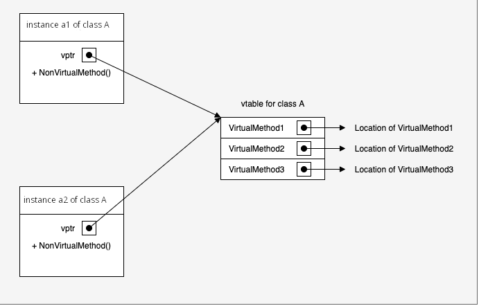
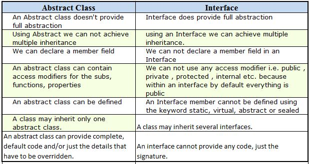

Here will be mentioned:
1. Overriding the base class. `override`, `new` keywords
2. Virtual methods and how they work (VMT). Early and late bindings.
3. Abstract classes
4. Interfaces
5. Abstact classes vs. interfaces.

For more examples, see `./MyInheritanceExamples/Program.cs`

## What kind of functions/properties child class does not inherit from the parent class?
Constructors and destructors. However, you can call parent's constructor explicitly:
```
class Base {
    public Base(T arg) {
        // do smth...
    }
}

class Child : Base {
    public Child(T arg) : base(arg) {}
}
``` 

## Overriding the base class

You can override some function from the base class in several ways:
```
class Base {
    public virtual void SayHello() {
        Console.WriteLine("Hey");
    }
}

// First:
class Child1 : Base {
    public override void SayHello() {
        Console.WriteLine("Hello");
    }
}

// Second:
class Child2 : Base {
    public new void SayHello() {
        Console.WriteLine("Hello");
    }
}

// Third:
class Child3 : Base {
    public virtual void SayHello() {
        Console.WriteLine("Hello");
    }
    
    // Or just (some say it won't compile but it works on my machine xD):
    public void SayHello() {
        Console.WriteLine("Hello");
    }
}
```

What's the difference between all these? If you will call only derived classes, there's literally no difference. However: 

For examples in code see `./MyInheritanceExamples/Program.cs`. 

1. `override` keyword overrides the virtual function from the base class while casting to the base class (see )
2. `new` and `virtual` **in child class** and new declaration in child class don't do this. They simple create new, unrelated to the parent class function just with the same name, whereas `virtual` and `override` functions are tied by so-called Virtual Methods Table. For more details for why does it happen see `https://pnguyen.io/posts/virtual-new-override-csharp/`

## What is Virtual Methods Table (VMT) and how it works?
(VMT is also sometimes called `vtable` or `dispatch table`)

VMT is used to determine at **run time** which method from which class in the hierarchy to call. If class has at least 1 virtual method, it will also have pointer to its VMT. This pointer will always be at the beggining of the object address (see an image below). All object instances of the same class will share the same vtable.



**How C# decides what method to call during run time is described here: `https://pnguyen.io/posts/virtual-new-override-csharp/`**

## What are early/late-bindings?

Early bindings refer to events that happen at compile time when compiler has all information it needs about an object (oversimplified speaking, it's nearly everything except virtual functions: normal function calls, overloaded functions, overloaded operators etc.). In other words, early binding is possible when no additional look up about objects is needed. So, for example, early binded objects will throw an error already while your code is compiling, unlike late-bindings that will crash only at a run time.

Because of no additional look up is needed, early binding is faster than late binding.

## What is an abstract class?

Abstract classes describe abstract entities, therefore it is not possible to create an instance of the abstract class. Also, you can inherit only from 1 abstract class. Abstract members (functions, properties) can be either already defined, or not(therefore, child class should provide an implementation of such a member, similarly to interfaces). For example:
```
abstract class Animal {
    public void sleep() {
        Console.WriteLine("I am sleeping right now");
    }

    public abstract void move();
}

class Bird : Animal {
    public override void move() {
        fly();
    }

    private void fly() {
        Console.WriteLine("I am flying rigth now!");
    }
}

Bird bird = new Bird();
bird.move();
bird.sleep();

/* I am flying right now!
 * I am sleeping right now.
 */
```

## What is an interface?

Interfaces are similar to abstact classes, they also define a "contract" that a child class that inherites from it should implement. Unlike in abstract classes, in interfaces you can't define members. However, you are capable of creating an instance of the interface. 

The fact that you can create its intances is helpful to use polymorfism. Considering previous example with the animal and the bird, imagine you defined a similar interface (not abstract class) Animal and a bunch of other animals that implement this interface. Then, you can, for example, have an array of all these animals and call their common members. See example:
```
interface IAnimal {
    void move();
}

class Bird : IAnimal {
    public void move() {
        Console.WriteLine("I am flying!");
    }    
}

class Leopard : IAnimal {
    public void move() {
        Console.WriteLine("I am running!")
    }
}

class Fish : IAnimal {
    public void move() {
        Console.WriteLine("I am swimming!");
    }
}

IAnimal animals = new IAnimal[] { new Bird(), new Leopard(), new Fish() };

foreach (IAnimal animal in animals) {
    animal.move();
}
``` 

## What is the difference between an interface and an abstract class?
See picture:


